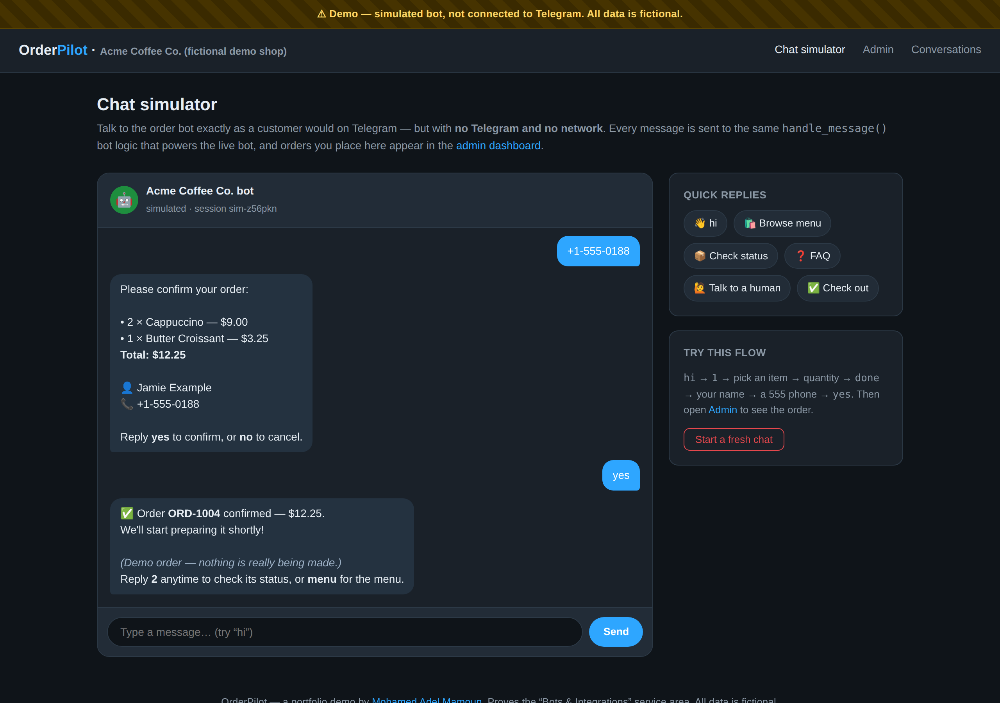
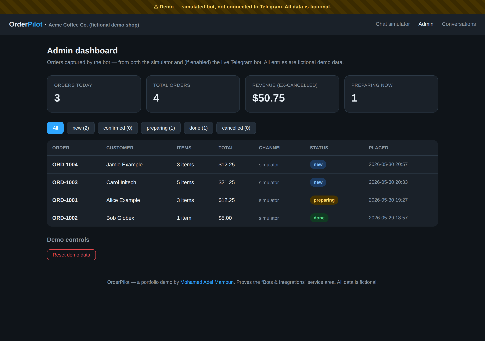
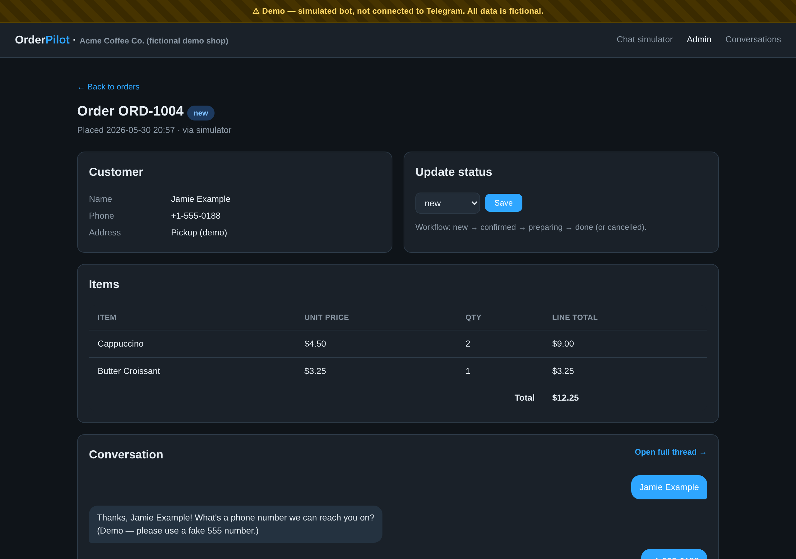
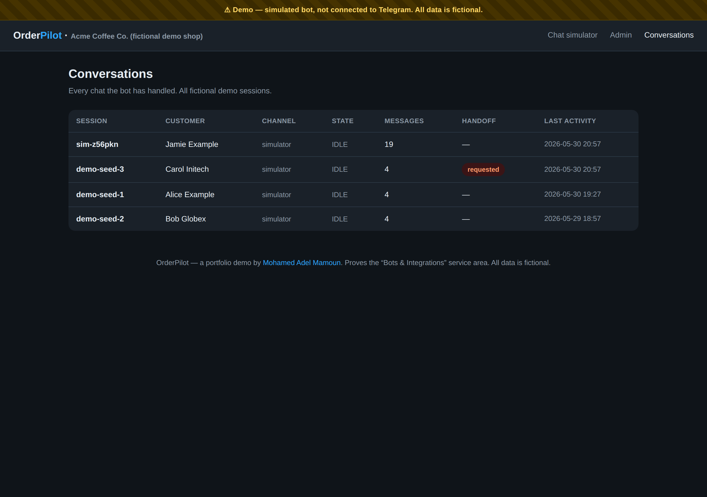

# OrderPilot — Bots & Integrations

> A real **order-taking chatbot** for a small shop: customers browse a catalog, place an order, check its status, get FAQ answers, and request a human — all through chat. Orders and conversations persist in **SQLite** and are worked from a **server-rendered admin dashboard**. The same bot brain runs on **real Telegram** (full version) *and* an **in-browser chat simulator** (the demo). The demo runs **100% offline with zero config** — no bot token, no Telegram, no network.

[](https://www.python.org)
[](https://fastapi.tiangolo.com)
[](https://www.sqlite.org)
[](https://python-telegram-bot.org)
[](./LICENSE)

OrderPilot proves the **Bots & Integrations** service area: the kind of conversational assistant a small business could put on Telegram to take orders and answer FAQs around the clock, with a back-office dashboard to actually run those orders. **Every shop, product, customer and order is fake by construction** — a fictional “Acme Coffee Co.”, `example.com`-style placeholders, and reserved `555-01xx` phone numbers. A persistent banner makes clear nothing is connected to live Telegram.

---

## Screenshots



| Admin dashboard | Order detail + status workflow | Conversations |
| --- | --- | --- |
|  |  |  |

---

## What it proves

A genuine chatbot + back-office integration, not a mockup:

1. **One bot brain, two front-ends.** All conversation logic lives in a single, explicit state machine — [`orderpilot/bot.py`](orderpilot/bot.py). The demo's web chat simulator and the live Telegram handler are thin adapters that both call the *same* `handle_message()`. What you test in the browser is exactly what ships to Telegram.
2. **A real conversation flow.** Browse the catalog → add items with quantities → check out → give a name and phone → confirm. The bot also does **order-status lookup**, an **FAQ menu**, and a **human-handoff** request — each a distinct conversational state, with `menu` as a global escape hatch.
3. **Persistence that matters.** Conversations, every individual message, and orders are stored in **SQLite**. Refresh, restart — the data and the in-progress conversation state survive.
4. **A working admin back-office.** Server-rendered dashboard with KPIs (orders today, revenue, by-status), a filterable orders table, an **order detail page with the full status workflow** (`new → confirmed → preparing → done / cancelled`), the attached conversation thread, and a conversations browser that flags **human-handoff** requests.
5. **Honest, self-contained demo.** Boots into a simulator on **bundled, obviously-fictional** seed data — no token, no network. A “Reset demo data” button restores the seed.

## Demo mode vs. the full (live) version

| | **Demo (default)** | **Full / live** |
| --- | --- | --- |
| Front-end | In-browser **chat simulator** | **Real Telegram** bot |
| Config needed | **None** | `TELEGRAM_BOT_TOKEN` |
| Network | None | Telegram API |
| Bot logic | `orderpilot/bot.py` | **the same** `orderpilot/bot.py` |
| Storage | SQLite | SQLite |

The live Telegram code is present and wired up in [`orderpilot/telegram_bot.py`](orderpilot/telegram_bot.py) but stays **OFF** unless a token is set — so the demo never touches Telegram and doesn't even require the `python-telegram-bot` dependency.

## Tech stack

**Python** · **FastAPI** + **Uvicorn** (web app + bot endpoint) · **Jinja2** (server-rendered admin) · **SQLite** (`sqlite3`, no ORM) · **python-telegram-bot** (live mode only). No API keys required for the demo.

```
orderpilot/
├── app.py                      # FastAPI: simulator page, /api/chat, admin dashboard
├── orderpilot/
│   ├── bot.py                  # THE bot logic — shared by simulator & Telegram
│   ├── telegram_bot.py         # live Telegram adapter (off unless token set)
│   ├── db.py                   # SQLite schema, queries, demo seed
│   ├── catalog.py              # fictional menu + FAQ copy
│   ├── config.py               # zero-config defaults
│   ├── templates/              # Jinja2: simulator + admin pages
│   └── static/style.css
├── tools/
│   ├── smoke.py                # end-to-end check: drive a full order, assert DB
│   └── shoot.py                # screenshot capture (Playwright)
└── docs/screenshots/
```

## Quick start (zero-config demo)

```bash
git clone git@github.com:MoAdelMamoun/orderpilot.git
cd orderpilot

python -m venv .venv && source .venv/bin/activate   # Windows: .venv\Scripts\activate
pip install -r requirements.txt

uvicorn app:app --reload      # open http://localhost:8000
```

That's it — no token, no network. You'll land on the **chat simulator**. Try:

> `hi` → `1` → pick an item → a quantity → `done` → your name → a `555` phone → `yes`

Then open **[http://localhost:8000/admin](http://localhost:8000/admin)** and watch your order appear, complete with its conversation. Move it through the status workflow on the order detail page.

Sanity-check the whole bot + persistence path without the web UI:

```bash
python tools/smoke.py
```

## Configuration (full / live Telegram version — optional)

The demo needs nothing. To run the **real Telegram bot**, copy `.env.example` to `.env`:

| Variable | Purpose |
| --- | --- |
| `TELEGRAM_BOT_TOKEN` | Token from [@BotFather](https://t.me/BotFather). **Empty by default → live bot OFF.** |
| `ORDERPILOT_SHOP_NAME` | Display name of the (fictional) shop. |
| `ORDERPILOT_DB_PATH` | Where the SQLite file lives. |

Then:

```bash
pip install "python-telegram-bot>=21"   # full-version dependency
export TELEGRAM_BOT_TOKEN=123456:your-token-here
python -m orderpilot.telegram_bot       # starts long-polling the live bot
```

The live bot serves the identical conversation flow; orders land in the same SQLite database and the same `/admin` dashboard.

## Deploy the demo

Because the demo makes no external calls, it's safe to host publicly:

- **Any container/VM** — `pip install -r requirements.txt && uvicorn app:app --host 0.0.0.0 --port $PORT`.
- **Fly.io / Render / Railway** — point the start command at `uvicorn app:app`. SQLite lives on disk; attach a volume if you want orders to persist across redeploys.

## Author

Built by **Mohamed Adel Mamoun** — full-stack developer.
🌐 [mohamedadelmamoun.com](https://mohamedadelmamoun.com)

One of a series of open-source portfolio projects, each proving a service area. OrderPilot proves **Bots & Integrations**.

## License

[MIT](./LICENSE)
